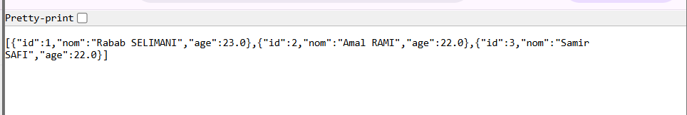
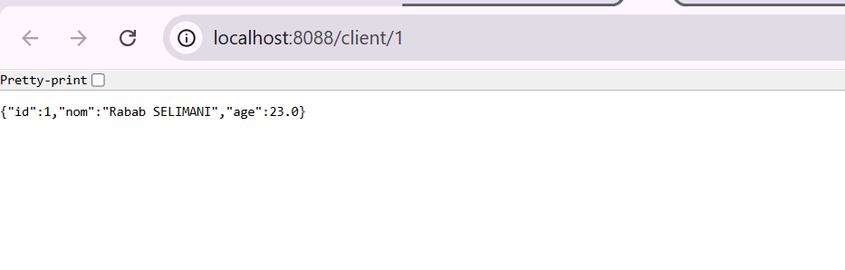
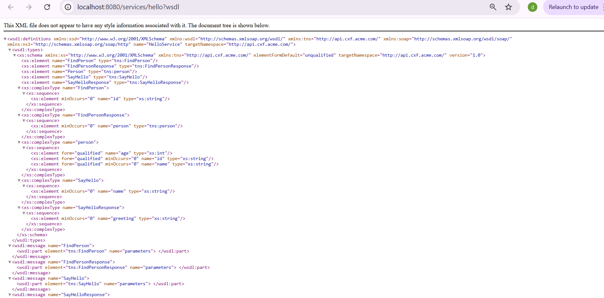

## REST & SOAP Services Demonstration

This section presents the implementation and testing of RESTful and SOAP web services developed using Spring Boot.

### REST API – Client Service

The REST service exposes HTTP endpoints that return client data in JSON format.

The endpoint `GET /client` retrieves the complete list of clients stored in the system.

The endpoint `GET /client/{id}` returns the details of a specific client identified by its unique ID.

### SOAP Web Service – FindPerson

A SOAP-based web service was implemented and tested using SoapUI.

The `FindPerson` operation receives a person identifier inside a SOAP envelope and returns the corresponding person information in XML format.

### WSDL – Service Description

The WSDL file defines the contract of the SOAP web service, including available operations, message structures, and data types.

